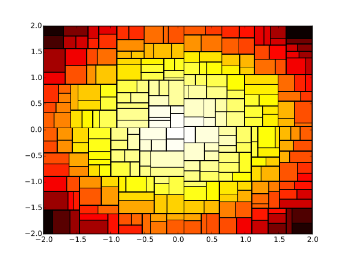

# Asymmetric Tree Clustering

> A code for clustering analysis using asymmetric tree structure

This code builds a kd-tree based on samples from a hyper space. The nodes "self-organises" in a way such that there more more nodes close the higher denstiy of the underlying function. Below is an example.

